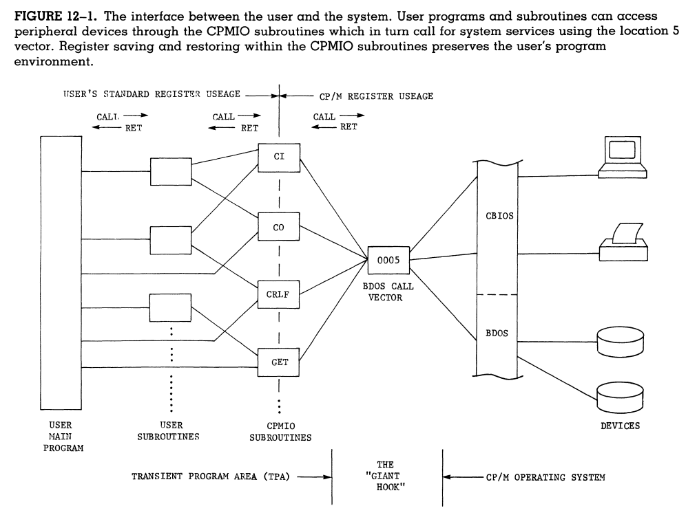

## Introduction
- Altair 8800 uses a single silicon chip

## Logic
- Most Computers are based on boolean logic concepts.
- Basic 3 logic gates are: And, Or, and Not.

## Electronic Logic
- Boolean Logic Gates can be implemented using transistor circuits.

Three Sybols Represent each of the basic boolean logic gates:

### And Boolean Table
| A | B | Out |
|---|---|-----|
| 0 | 0 |  0  |
| 0 | 1 |  1  |
| 1 | 0 |  0  |
| 1 | 1 |  1  |

### Or Boolean Table
| A | B | Out |
|---|---|-----|
| 0 | 0 |  0  |
| 0 | 1 |  1  |
| 1 | 0 |  1  |
| 1 | 1 |  1  |

### Not Boolean Table
| A | Out |
|---|-----|
| 0 |  1  |
| 1 |  0  |

The electronic logic gates are created with transistors, which is a type of electronic switch. The electronic gates can be combined to create NOR and NAND logic statement analogies. The statements negate the previous boolean gates.