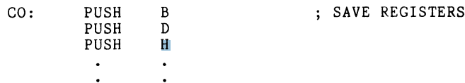
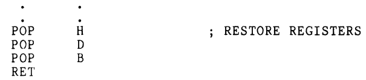
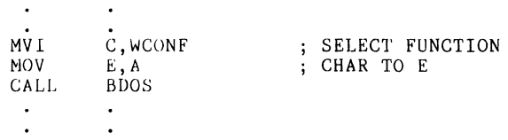

# CP/M Chapter 10 Presentation: Preserving the User's Enviorment
by Trostin Geles

## Key Vocabulary:
|   Term   | Definition |
| -------- | ---------- |
| Stack    | Aa memory area set aside as a easy place to store data, and a necessary mechanism for calling and returning from subroutines.  |
| TPA |  transient program area    |
| DS    | Define Storage    |
| DB    | Define Byte    |
| SP    | Stack Pointer    |
| CCP    | Console Command Processor    |
| LIFO Mechanism    | Last-In, First-Out mechanism   |
| WCONF    | Write-on-the-Console Function    |
| LXI    |  Load indeX with Immediate data    |

## Establishing the users stack:
1. You need to know where some RAM memory space is available. In a CP/M system programs execute within the TPA, and the TPA is in the RAM.
2. Next, you decide how big the stack is going to be. A safe size to start with is 64 bytes, which allows you to execute 32 successive PUSHes of register
contents, or nest 32 levels of subroutine CALLs. But likely you will use this space for a combination of PUSHes and CALLs. \
<B/>Assembly for setting up stack size:</B> \

3. The second line is only there to label the space STAK, so at assembly time will be loaded into SP at the very beginning of <B/>our program:</B> \

note: remember to LXI the SP at the start of all your programs, and make sure tha the stack space is large enough for all the pushing and calling you will be doing.

In the authors "TEST" program he didn't follow these previous steps heres why: When the Console Command Processor (CCP) loads and executes a .COM file (like "TEST"), it utilizes a pre-initialized stack space set by the CP/M operating system. The program, upon being loaded into the Transient Program Area (TPA), can use this stack space for brief execution. If a return (RET) instruction is used instead of a jump (JMP) in the program, the system will return to the CCP prompt without rebooting, which is a useful technique for short programs that don't exceed the CCP's stack limits. This method, however, requires caution to avoid stack overflow.

## Saving the user's register contents:
To ensure the seperation of usaer and system, we will want to preserve the contents of all the hardware registers every time CP/M is called upon for I/O services.

Since we have more then enough stack sapce, BDOS ca use some of that space whenever we call location 5.

To save and restore all of the other registers we will have to write a sries of I/O subroutines that start by saving the contents of B, C, D, E, H, and L on the stack (This will happen every time we pass data through the user/system window). \
<B/>Here is the assembly to save the registers:</B>
 \
This operation will take 3 bytes of program space and 6 bytes of stack space. \
Nowit doesn't matter whether or not the system disturbs the contents of these registers, because upon return from BDOS we will restore the registers. \
<B/>Here is the assembly to restore the registers:</B>

Note that the POPs mirror the PUSHes, this is because the stcak is a LIFO mechanism.

## Calling BDOS: 
We know, from having accomplished exactly that function in our example program, that BDOS wants the character to be in E, and a function code (WCONF) to be in C, when BDOS is called.

So affter pushing the registers onto the stack we have to complete the following subroutine: \

## Returning to CP/M:
For program termination, rather than pressing the RESET switch, we can return to the operating system safely using a JMP 0 instruction. This ensures the system is reloaded and prevents any disruptions.

If you have any other questions, the author sugests to refer to the 8080/8085 programming manual or Appendix B before moving ahead.

### Sources:
I used [WIKI CP/M](https://en.wikipedia.org/wiki/CP/M) to suplement my knowledge from the textbook.